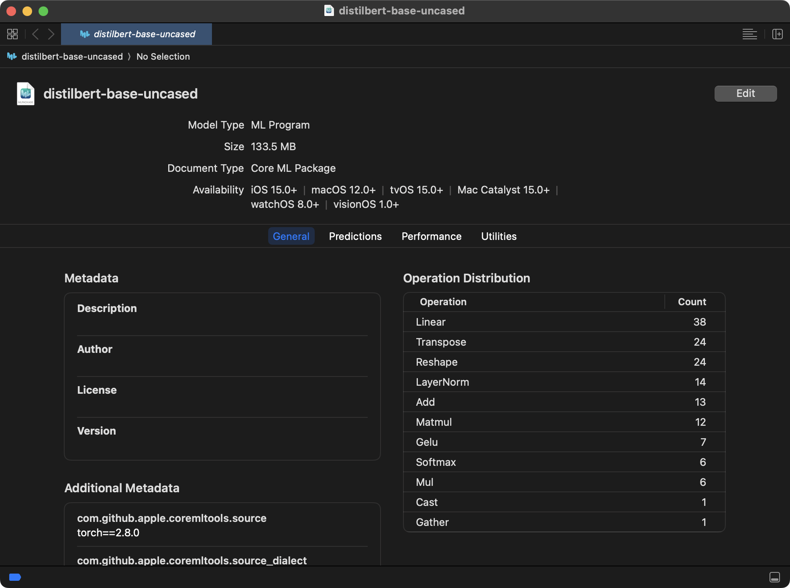

# Hugging Face 模型轉換為 Core ML 工具

這個專案包含一個 Python 腳本，用於將 Hugging Face Hub 上的預訓練模型轉換為 Apple 的 Core ML 格式（`.mlpackage`）。

## 成果


https://github.com/user-attachments/assets/2910c2fb-dce3-4ded-b05e-1505853f9e46

## 功能

- 從 Hugging Face Hub [自動下載](https://huggingface.co/)指定的 PyTorch 模型。
- 將[模型轉換](https://blog.csdn.net/weixin_42426841/article/details/142236561)為 Core ML 的 `mlprogram` 格式。
- 腳本內包含詳細的中文註解，方便理解與修改。

## 環境要求

- **Python 3.10+** (建議使用 3.11 以獲得最佳相容性)
- macOS 作業系統 (因為 Core ML 是 Apple 的框架)

## 安裝步驟

1.  **建立並啟用虛擬環境**

    在您的專案根目錄下，執行以下指令來建立並啟用一個 Python 虛擬環境。這是一個良好的習慣，可以避免套件版本衝突。

    ```bash
    # 建立虛擬環境 (建議使用與您系統相容的 python 版本，例如 python3.11)
    python3.11 -m venv .venv

    # 啟用虛擬環境
    source .venv/bin/activate
    ```

2.  **安裝依賴套件**

    使用 `requirements.txt` 檔案來安裝所有必要的 Python 套件。

    ```bash
    pip install -r requirements.txt
    ```

## 如何使用

1.  **執行轉換**

    確認您已啟用虛擬環境後，執行以下指令：

    ```bash
    python convert.py -h
    
    python convert.py 
        --model_id <模型路徑> 
        --model_type <default / masked / causal / seq2seq / question / token / sequence> 
        --output <輸出檔名>
    
    python convert.py --model_id distilbert-base-uncased --model_type masked
    
    python convert.py --model_id "meta-llama/Llama-3.2-1B" --model_type causal
    ```

    腳本將會開始下載模型並進行轉換。完成後，您會在專案目錄下看到一個新的 `.mlpackage` 檔案。
